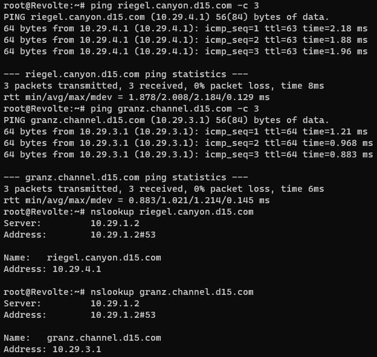

# **Lapres Praktikum Jarkom Modul 3 Kelompok D15**

### **Anggota Kelompok**

| **Nama**                  | **NRP**    |
| ------------------------- | ---------- |
| Rayhan Arvianta Bayuputra | 5025211217 |
| Yehezkiel Wiradhika       | 5025201086 |

## Daftar Isi

- [Prerequisites](#Prerequisites)
    - [Setup Topologi](#SetupTopologi)
    - [Konfigurasi Network](#KonfigurasiNetwork)
- [Soal 0](#Soal-0)
- [Setup DHCP](#Setup-DHCP)
- [PHP Worker](#PHP-Worker)
    - [Soal 6](#Soal-6)
    - [Soal 7](#Soal-7)
    - [Soal 8](#Soal-8)
    - [Soal 9](#Soal-9)
    - [Soal 10](#Soal-10)
    - [Soal 11](#Soal-11)
    - [Soal 12](#Soal-12)
- [Laravel Worker](#Laravel-Worker)
    - [Soal 13](#Soal-13)
    - [Soal 14](#Soal-14)
    - [Soal 15](#Soal-15)
    - [Soal 16](#Soal-16)
    - [Soal 17](#Soal-17)
    - [Soal 18](#Soal-18)
    - [Soal 19](#Soal-19)
    - [Soal 20](#Soal-20)

## Prerequisites

Terdapat beberapa hal yang harus disiapkan sebelum terjun ke soal-soal praktikum, yaitu setup topologi dan network configurations yang ada. _**(Soal 1)**_

### Setup Topologi

Topologi disiapkan sesuai dengan ketentuan pada praktikum, seperti pada gambar dan tabel berikut.


| Node               | Kategori         | Image Docker                        | Konfigurasi IP | 
|--------------------|------------------|-------------------------------------|----------------| 
| Aura               | Router (DHCP Relay)| danielcristh0/debian-buster:1.1   | Dynamic        | 
| Himmel             | DHCP Server      | danielcristh0/debian-buster:1.1   | Static         | 
| Heiter             | DNS Server       | danielcristh0/debian-buster:1.1   | Static         | 
| Denken             | Database Server  | danielcristh0/debian-buster:1.1   | Static         | 
| Eisen              | Load Balancer    | danielcristh0/debian-buster:1.1   | Static         | 
| Frieren            | Laravel Worker   | danielcristh0/debian-buster:1.1   | Static         | 
| Flamme             | Laravel Worker   | danielcristh0/debian-buster:1.1   | Static         | 
| Fern               | Laravel Worker   | danielcristh0/debian-buster:1.1   | Static         | 
| Lawine             | PHP Worker       | danielcristh0/debian-buster:1.1   | Static         | 
| Linie              | PHP Worker       | danielcristh0/debian-buster:1.1   | Static         | 
| Lugner             | PHP Worker       | danielcristh0/debian-buster:1.1   | Static         | 
| Revolte            | Client           | danielcristh0/debian-buster:1.1   | Dynamic        | 
| Richter            | Client           | danielcristh0/debian-buster:1.1   | Dynamic        | 
| Sein               | Client           | danielcristh0/debian-buster:1.1   | Dynamic        | 
| Stark              | Client           | danielcristh0/debian-buster:1.1   | Dynamic        | 

### Konfigurasi Network

Dengan ketentuan yang ada, berikut adalah list IP dan network configuration dari tiap node.

#### IPs

```
Aura: Dynamic DHCP
Himmel: 10.29.1.1
Heiter: 10.29.1.2
Denken: 10.29.2.1
Elsen: 10.29.2.2
Frieren: 10.29.4.1
Flamme: 10.29.4.2
Fern: 10.29.4.3
Lawine: 10.29.3.1
Linie: 10.29.3.2
Lugner: 10.29.3.3
Revolte: Dynamic DHCP
Richter: Dynamic DHCP
Sein: Dynamic DHCP
Stark: Dynamic DHCP
```

#### Aura (Router/DHCP Relay)

```
auto eth0
iface eth0 inet dhcp

auto eth1
iface eth1 inet static
	address 10.29.1.254
	netmask 255.255.255.0

auto eth2
iface eth2 inet static
	address 10.29.2.254
	netmask 255.255.255.0

auto eth3
iface eth3 inet static
	address 10.29.3.254
	netmask 255.255.255.0

auto eth4
iface eth4 inet static
	address 10.29.4.254
	netmask 255.255.255.0
```

#### Himmel (DHCP Server)

```
auto eth0
iface eth0 inet static	
address 10.29.1.1
netmask 255.255.255.0
gateway 10.29.1.254
```

#### Heiter (DNS Server)

```
auto eth0
iface eth0 inet static	
address 10.29.1.2
netmask 255.255.255.0
gateway 10.29.1.254
```

#### Denken (Database Server)

```
auto eth0
iface eth0 inet dhcp
hwaddress ether d2:5b:49:77:c6:53
```

#### Eisen (Load Balancer)

```
auto eth0
iface eth0 inet dhcp
hwaddress ether 2e:14:fa:49:d4:26
```

#### Frieren (Laravel Worker)

```
auto eth0
iface eth0 inet dhcp
hwaddress ether 62:85:dc:12:6a:e1
```

#### Flamme (Laravel Worker)

```
auto eth0
iface eth0 inet dhcp
hwaddress ether 0a:c9:e8:93:9a:99
```

#### Fern (Laravel Worker)

```
auto eth0
iface eth0 inet dhcp
hwaddress ether 56:68:5d:5c:05:38
```

#### Lawine (PHP Worker)

```
auto eth0
iface eth0 inet dhcp
hwaddress ether 26:5f:26:7d:8f:93
```

#### Linie (PHP Worker)

```
auto eth0
iface eth0 inet dhcp
hwaddress ether a2:22:e8:fa:6f:3d
```

#### Lugner (PHP Worker)

```
auto eth0
iface eth0 inet dhcp
hwaddress ether 26:88:d2:3f:d6:34
```

#### Revolte (Client)

```
auto eth0
iface eth0 inet dhcp
```

#### Ritcher (Client)

```
auto eth0
iface eth0 inet dhcp
```

#### Sein (Client)

```
auto eth0
iface eth0 inet dhcp
```

#### Stark (Client)

```
auto eth0
iface eth0 inet dhcp
```

## Soal 0
Setelah mengalahkan Demon King, perjalanan berlanjut. Kali ini, kalian diminta untuk melakukan register domain berupa **riegel.canyon.yyy.com** untuk worker Laravel dan **granz.channel.yyy.com** untuk worker PHP (0) mengarah pada worker yang memiliki IP [prefix IP].x.1.

Sebelumnya kita harus menginstall bind9 sebelum nantinya dikonfigurasi seperti keinginan soal.

```sh
apt-get update
apt-get install bind9 -y
```

Kemudian kita konfigurasi Bind9 seperti keinginan soal, mulai dari ``named.conf.local``, ``named.conf.options``, hingga bind zone file dari setiap zone.

_named.conf.local_

```
//
// Do any local configuration here
//

// Consider adding the 1918 zones here, if they are not used in your
// organization
//include "/etc/bind/zones.rfc1918";

zone "riegel.canyon.d15.com" {
        type master;
        file "/etc/bind/jarkom/riegel.canyon.d15.com";
};

zone "granz.channel.d15.com" {
        type master;
        file "/etc/bind/jarkom/granz.channel.d15.com";
};
```

Pada file tersebut dideklarasikan dua zone untuk setiap domain.

_named.conf.options_

```
options {
        directory "/var/cache/bind";

        // If there is a firewall between you and nameservers you want
        // to talk to, you may need to fix the firewall to allow multiple
        // ports to talk.  See http://www.kb.cert.org/vuls/id/800113

        // If your ISP provided one or more IP addresses for stable
        // nameservers, you probably want to use them as forwarders.
        // Uncomment the following block, and insert the addresses replacing
        // the all-0's placeholder.

        forwarders {
                192.168.122.1;
        };

        //========================================================================
        // If BIND logs error messages about the root key being expired,
        // you will need to update your keys.  See https://www.isc.org/bind-keys
        //========================================================================
        //dnssec-validation auto;

        allow-query{any;};
        listen-on-v6 { any; };
};
```

Disini kita forward nameserver dari router supaya client atau server yang connect ke DNS Server mendapatkan internet.

**/etc/bind/jarkom/riegel.canyon.d15.com**

```
;
; BIND data file for local loopback interface
;
$TTL    604800
@       IN      SOA     riegel.canyon.d15.com. root.riegel.canyon.d15.com. (
                              2         ; Serial
                         604800         ; Refresh
                          86400         ; Retry
                        2419200         ; Expire
                         604800 )       ; Negative Cache TTL
;
@       IN      NS      riegel.canyon.d15.com.
@       IN      A       10.29.4.1       ; IP Frieren
www     IN      CNAME   riegel.canyon.d15.com.
```

**/etc/bind/jarkom/granz.channel.d15.com**

```
;
; BIND data file for local loopback interface
;
$TTL    604800
@       IN      SOA     granz.channel.d15.com. root.granz.channel.d15.com. (
                              2         ; Serial
                         604800         ; Refresh
                          86400         ; Retry
                        2419200         ; Expire
                         604800 )       ; Negative Cache TTL
;
@       IN      NS      granz.channel.d15.com.
@       IN      A       10.29.3.1       ; IP Lawine
www     IN      CNAME   granz.channel.d15.com.
```

Setelah mengkonfigurasi setiap zone dengan mengarahkan ke IP worker tujuan, hasilnya dapat diperiksa di client dengan menggunakan **ping** dan **nslookup**.



## Setup DHCP
Setup DHCP akan meliputi soal 2 hingga soal 5.
- Semua **CLIENT** harus menggunakan konfigurasi dari DHCP Server.
- Client yang melalui Switch3 mendapatkan range IP dari [prefix IP].3.16 - [prefix IP].3.32 dan [prefix IP].3.64 - [prefix IP].3.80 **(2)**
- Client yang melalui Switch4 mendapatkan range IP dari [prefix IP].4.12 - [prefix IP].4.20 dan [prefix IP].4.160 - [prefix IP].4.168 **(3)**
- Client mendapatkan DNS dari Heiter dan dapat terhubung dengan internet melalui DNS tersebut **(4)**
- Lama waktu DHCP server meminjamkan alamat IP kepada Client yang melalui Switch3 selama 3 menit sedangkan pada client yang melalui Switch4 selama 12 menit. Dengan waktu maksimal dialokasikan untuk peminjaman alamat IP selama 96 menit **(5)**

Untuk memenuhi kebutuhan soal, kita install isc-dhcp-server pada Himmel dan isc-dhcp-relay.

**Instalasi di Aura**

```
apt-get update
apt-get install isc-dhcp-relay -y
```

**Instalasi di Himmel**

```
apt-get update
apt-get install isc-dhcp-server -y
```

Kemudian kita lakukan konfigurasi pada **Himmel**

**/etc/dhcp/dhcpd.conf**

```
subnet 10.29.1.0 netmask 255.255.255.0 {
}

subnet 10.29.2.0 netmask 255.255.255.0 {
    option routers 10.29.2.254;
    option broadcast-address 10.29.2.255;
    option domain-name-servers 10.29.1.2;
    default-lease-time 7200;
    max-lease-time 7200;
}

#Client Switch 3
subnet 10.29.3.0 netmask 255.255.255.0 {
    range 10.29.3.16 10.29.3.32;
    range 10.29.3.64 10.29.3.80;
    option routers 10.29.3.254;
    option broadcast-address 10.29.3.255;
    option domain-name-servers 10.29.1.2;
    default-lease-time 180;
    max-lease-time 5760;
}

#Client Switch 4
subnet 10.29.4.0 netmask 255.255.255.0 {
    range 10.29.4.12 10.29.4.20;
    range 10.29.4.160 10.29.4.168;
    option routers 10.29.4.254;
    option broadcast-address 10.29.4.255;
    option domain-name-servers 10.29.1.2;
    default-lease-time 720;
    max-lease-time 5760;
}

#Database Server
host Denken {
    hardware ethernet d2:5b:49:77:c6:53;
    fixed-address 10.29.2.1;
}

#Load Balancer
host Eisen {
    hardware ethernet 2e:14:fa:49:d4:26;
    fixed-address 10.29.2.2;
}

#Laravel Workers
host Frieren {
    hardware ethernet 62:85:dc:12:6a:e1;
    fixed-address 10.29.4.1;
}

host Flamme {
    hardware ethernet 0a:c9:e8:93:9a:99;
    fixed-address 10.29.4.2;
}

host Fern {
    hardware ethernet 56:68:5d:5c:05:38;
    fixed-address 10.29.4.3;
}

#PHP Workers
host Lawine {
    hardware ethernet 26:5f:26:7d:8f:93;
    fixed-address 10.29.3.1;
}

host Linie {
    hardware ethernet a2:22:e8:fa:6f:3d;
    fixed-address 10.29.3.2;
}

host Lugner {
    hardware ethernet 26:88:d2:3f:d6:34;
    fixed-address 10.29.3.3;
}
```

**/etc/default/isc-dhcp-dhcp-server**

```
# Defaults for isc-dhcp-server (sourced by /etc/init.d/isc-dhcp-server)

# Path to dhcpd's config file (default: /etc/dhcp/dhcpd.conf).
#DHCPDv4_CONF=/etc/dhcp/dhcpd.conf
#DHCPDv6_CONF=/etc/dhcp/dhcpd6.conf

# Path to dhcpd's PID file (default: /var/run/dhcpd.pid).
#DHCPDv4_PID=/var/run/dhcpd.pid
#DHCPDv6_PID=/var/run/dhcpd6.pid

# Additional options to start dhcpd with.
#       Don't use options -cf or -pf here; use DHCPD_CONF/ DHCPD_PID instead
#OPTIONS=""

# On what interfaces should the DHCP server (dhcpd) serve DHCP requests?
#       Separate multiple interfaces with spaces, e.g. "eth0 eth1".
INTERFACESv4="eth0"
INTERFACESv6=""
```

Kemudian kita lakukan konfigurasi pada **Aura**

**/etc/default/isp-dhcp-relay**

```
# Defaults for isc-dhcp-relay initscript
# sourced by /etc/init.d/isc-dhcp-relay
# installed at /etc/default/isc-dhcp-relay by the maintainer scripts

#
# This is a POSIX shell fragment
#

# What servers should the DHCP relay forward requests to?
SERVERS="10.29.1.1"

# On what interfaces should the DHCP relay (dhrelay) serve DHCP requests?
INTERFACES="eth1 eth2 eth3 eth4"

# Additional options that are passed to the DHCP relay daemon?
OPTIONS=""
```

Dan un-comment ``net.ipv4.ip_forward=1`` pada **/etc/sysctl.conf**.

Jangan lupa untuk restart service DHCP pada setiap node setelah melakukan konfigurasi dengan menggunakan command ``service dhcp-(relay/server)-restart``.

Berikut adalah hasil dari sisi client


## PHP Worker

Segala konfigurasi dan testing pada PHP Worker memenuhi soal 6 hingga 12. Sebagai persiapan, kita harus menginstall nginx, php7.3, php7.3-fpm, htop, wget, dan zip/unzip pada setiap worker.
```sh
apt-get update -y
apt-get install nginx php7.3 php7.3-fpm htop wget unzip -y
```

### Soal 6
Pada masing-masing worker PHP, lakukan konfigurasi virtual host untuk website <a href="https://drive.google.com/file/d/1ViSkRq7SmwZgdK64eRbr5Fm1EGCTPrU1/view?usp=sharing">berikut</a> dengan menggunakan php 7.3.

Hal-hal yang kita harus penuhi adalah mendownload dan unzip source code website, hingga configure nginx agar bisa diaccess client.

Download dan unzip source code website dengan menggunakan wget dan unzip pada /var/www
```sh
wget --no-check-certificate 'https://drive.usercontent.google.com/download?id=1ViSkRq7SmwZgdK64eRbr5Fm1EGCTPrU1&export=download&authuser=0&confirm=t&uuid=0e499712-8150-42d4-a474-b29dfb026ab6&at=APZUnTVBse4ducwDDntmAkLSWB1_:1699949521984' -O  granz.channel.d15.com
unzip granz.channel.d15.com
```

setting nginx masing-masing worker di **/etc/nginx/sites-available/default**

```
server {
        listen 80 default_server;
        listen [::]:80 default_server;

        root /var/www/html;

        index index.php index.html index.htm;

        server_name _;

        location / {
                try_files $uri $uri/ =404;
        }

        location ~ \.php$ {
                include snippets/fastcgi-php.conf;
                fastcgi_pass unix:/run/php/php7.3-fpm.sock;
        }
}
```

aktifkan php7.3-fpm dan nginx pada masing-masing worker

```
service php7.3-fpm start
service nginx start
```

setelah itu, kita melakukan setting di load balancer Eisen

untuk menjadikan Eisen load balancer sekaligus untuk keperluan testing, kita perlu menginstall beberapa hal, yakni nginx, php7.3. php7.3-fpm, htop, dan apache2-utils

```
$ apt-get update -y
$ apt-get install nginx php7.3 php7.3-fpm htop apache2-utils -y
```

kita lalu melakukan konfigurasi load balancer untuk **granz.channel.d15.com**

```
upstream backend  {
    hash $request_uri consistent;
    server 10.29.3.1; #IP Lawine
    server 10.29.3.2; #IP Linie
    server 10.29.3.3; #IP Lugner
}

server {
        listen 80;
        server_name granz.channel.d15.com;

        location / {
                proxy_pass http://backend;
                proxy_set_header    X-Real-IP $remote_addr;
                proxy_set_header    X-Forwarded-For $proxy_add_x_forwarded_for;
                proxy_set_header    Host $http_host;
        }

        location ~ /\.ht {
                deny all;
        }

        error_log /var/log/nginx/lb_error.log;
        access_log /var/log/nginx/lb_access.log;
}
```

### Soal 7
disini kita akan mengatur agar Eisen dapat bekerja dengan maksimal, lalu melakukan testing dengan 1000 request dan 100 request/second

command yang kita gunakan untuk melakukan testing:

```
$ ab -n 1000 -c 100 http://granz.channel.d15.com/
```

berikut merupakan hasil testing dengan menggunakan algoritma load balancing round robin, least connection, ip hash, dan generic hash

**roundrobin**

Complete requests:      1000

Failed requests:        0

Requests per second:    1130.87 [#/sec] (mean)

**least connection**

Complete requests:      1000

Failed requests:        0

Requests per second:    1143.11 [#/sec] (mean)

**ip hash**

Complete requests:      1000

Failed requests:        0

Requests per second:    1254.86 [#/sec] (mean)

**generic hash**

Complete requests:      1000

Failed requests:        0

Requests per second:    1232.61 [#/sec] (mean)

dari sini kita menyimpulkan bahwa algoritma terbaik adalah ip hash karena tidak ada request yang gagal dan dengan kecepatan request per detik yang paling tinggi dibanding dengan algoritma lainnya

### Soal 8
analisis hasil testing dengan 200 request dan 10 request/second masing-masing algoritma Load Balancer

command untuk testing:

```
$ ab -n 200 -c 10 http://granz.channel.d15.com/
```

**Round Robin**

Report hasil testing apache benchmark:


Hasil testing grafik htop:


**Least Connection**

Report hasil testing apache benchmark:


Hasil testing grafik htop:


**IP Hash**

Report hasil testing apache benchmark:


Hasil testing grafik htop:


**Generic Hash**

Report hasil testing apache benchmark:


Hasil testing grafik htop:


**Grafik request per second masing-masing algoritma**


**Analisis**

Berdasarkan dari data hasil testing dengan menggunakan Apache Benchmark dan grafik request per second, kita dapat menyimpulkan bahwa algoritma load balancing paling cepat adalah generic hash, tetapi kecepatannya relatif sama dengan algoritma Round Robin dan IP Hash, sedangkan algoritma yang paling lambat (request per secondnya) adalah Least Connection, tetapi dua algoritma yang paling banyak mengalami failed requests adalah Round Robin dan Least Connection, sedangkan algoritma IP Hash dan Generic Hash tidak mengalami failed requests sama sekali.

### Soal 9
Disini kita akan melakukan testing dengan menggunakan algoritma Round Robin dengan 3 worker, 2 worker, dan 1 worker sebanyak 100 request dengan 10 request/second, kemudian kita akan melihat perbandingan mereka dengan membuat grafik

command untuk testing
```
$ ab -n 100 -c 10 http://granz.channel.d15.com/
```

**3 Worker**

apache benchmark:


grafik htop:


**2 Worker**

apache benchmark:


grafik htop:


**1 Worker**

apache benchmark:


grafik htop:


Berikut merupakan grafik perbandingannya


### Soal 10
Di sini, kita akan melakukan konfigurasi autentikasi di LB dengan dengan kombinasi username: “netics” dan password: “ajkyyy”, dengan yyy merupakan kode kelompok. Terakhir simpan file “htpasswd” nya di /etc/nginx/rahasisakita/

untuk autentikasi, kita perlu membuat file berisi username dan password dengan command sebagai berikut

```
$ htpasswd -b -c /etc/nginx/rahasisakita/.htpasswd netics ajkd15
```

kemudian, kita perlu menambahkan konfigurasi berikut pada ``/etc/nginx/sites-available/lb-jarkom``

```
auth_basic "Administrator's Area";
auth_basic_user_file /etc/nginx/rahasiakita/.htpasswd;
```

### Soal 11
Di sini kita membuat setiap request yang mengandung /its akan di proxy passing menuju halaman https://www.its.ac.id

untuk melakukannya, kita perlu menambahkan beberapa konfigurasi pada Eisen, tepatnya di ``/etc/nginx/sites-available/lb-jarkom`` dengan konfigurasi sebagai berikut:

```
location ~ /its {
        proxy_pass https://www.its.ac.id;
        proxy_set_header Host www.its.ac.id;
        proxy_set_header X-Real-IP $remote_addr;
        proxy_set_header X-Forwarded-For $proxy_add_x_forwarded_for;
        proxy_set_header X-Forwarded-Proto $scheme;
}
```

### Soal 12
Selanjutnya LB ini hanya boleh diakses oleh client dengan IP [Prefix IP].3.69, [Prefix IP].3.70, [Prefix IP].4.167, dan [Prefix IP].4.168

untuk melakukannya, kita perlu menambahkan beberapa konfigurasi pada Eisen, tepatnya di ``/etc/nginx/sites-available/lb-jarkom`` dengan konfigurasi sebagai berikut:

```
allow 10.29.3.69;
allow 10.29.3.70;
allow 10.29.4.167;
allow 10.29.4.168;
deny all;
```

Berikut merupakan konfigurasi lengkap ``/etc/nginx/sites-available/lb-jarkom`` dengan algoritma Round Robin (default)

```
upstream backend  {
server 10.29.3.1; #IP Lawine
server 10.29.3.2; #IP Linie
server 10.29.3.3; #IP Lugner
}

server {
listen 80;
server_name granz.channel.d15.com;

        location / {
                proxy_pass http://backend;
                proxy_set_header    X-Real-IP $remote_addr;
                proxy_set_header    X-Forwarded-For $proxy_add_x_forwarded_for;
                proxy_set_header    Host $http_host;

                auth_basic "Administrator's Area";
                auth_basic_user_file /etc/nginx/rahasiakita/.htpasswd;

                allow 10.29.3.69;
                allow 10.29.3.70;
                allow 10.29.4.167;
                allow 10.29.4.168;
                deny all;
        }

        location ~ /its {
                proxy_pass https://www.its.ac.id;
                proxy_set_header Host www.its.ac.id;
                proxy_set_header X-Real-IP $remote_addr;
                proxy_set_header X-Forwarded-For $proxy_add_x_forwarded_for;
                proxy_set_header X-Forwarded-Proto $scheme;
        }

        location ~ /\.ht {
                deny all;
        }

        error_log /var/log/nginx/lb_error.log;
        access_log /var/log/nginx/lb_access.log;
}
```

## Setting Database


### Soal 13
Semua data yang diperlukan, diatur pada Denken dan harus dapat diakses oleh Frieren, Flamme, dan Fern.

#### Setting DB Server, Denken
hal pertama yang kita harus lakukan adalah install mariadb dan mysql di server DB, Denken

```
$ apt-get update -y
$ apt-get install mariadb-server -y
```

kemudian, kita lakukan config agar database pada Denken, tepatnya di ``/etc/mysql/mariadb.conf.d/50-server.cnf`` dapat diakses oleh worker Laravel. 

Disini, kita hanya perlu mengganti ip address dari _bind-address_ sehingga menjadi 0.0.0.0

```
bind-address            = 0.0.0.0
```

kemudian kita perlu untuk membuat account yang dapat digunakan di worker Laravel.

pertama, kita buka mysql server dengan privilege root dengan menggunakan command

```
$ mysql -u root
```

kemudian didalam mysql, kita menjalankan command berikut

```
> CREATE USER userd15@'%' IDENTIFIED BY 'passwordd15';
> GRANT ALL PRIVILEGES ON *.* TO userd15@'%' WITH GRANT OPTION;
> FLUSH PRIVILEGES;
> EXIT;
```

jalankan mysql server dengan command:

```
$ service mysql start
```

## Laravel Worker

### Soal 14
Kita perlu melakukan instalasi laravel beserta dengan aplikasi web di Frieren, Flamme, dan Fern kemudian melakukan pengaturan load balancer di Riegel Channel

#### Instalasi Laravel pada Worker

Pada worker Laravel, Frieren, Flamme, dan Fern, kita perlu melakukan instalasi php8.0, composer, wget, unzip, git, beberapa tools yang dibutuhkan lainnya, dan repository laravel soal dengan command sebagai berikut

```
# update
apt-get update -y

# install php8.0
apt install -y gnupg2 ca-certificates apt-transport-https software-properties-common wget curl git unzip
wget -qO - https://packages.sury.org/php/apt.gpg | apt-key add -
echo "deb https://packages.sury.org/php/ buster main" | tee /etc/apt/sources.list.d/php.list
apt-get update -y
apt install php8.0 -y
apt install php8.0-{mysql,imap,ldap,xml,curl,mbstring,zip,fpm,cli} -y

# start services
service php8.0-fpm start

# install composer
curl -sS https://getcomposer.org/installer -o composer-setup.php
php composer-setup.php --install-dir=/usr/local/bin --filename=composer

# install mariadb-client
apt-get install mariadb-client -y

# install repo
cd /var/www
git clone https://github.com/martuafernando/laravel-praktikum-jarkom
cd /var/www/laravel-praktikum-jarkom
composer update
cp /root/dotenv /var/www/laravel-praktikum-jarkom/.env
php artisan key:generate
php artisan config:cache
php artisan migrate
php artisan db:seed
php artisan storage:link
php artisan jwt:secret
php artisan config:clear
chown -R www-data.www-data /var/www/laravel-praktikum-jarkom/storage

# install nginx
apt-get install nginx -y
```

setelah itu kita perlu melakukan aktivasi service nginx dan php8.0-fpm dengan command:

```
$ service nginx start
$ service php8.0-fpm start
```

setelah itu, kita perlu melakukan konfigurasi nginx pada ``/etc/nginx/sites-available/laravel-praktikum-jarkom`` sebagai berikut:

```
server {

    listen 8001;

    root /var/www/laravel-praktikum-jarkom/public;

    index index.php index.html index.htm;
    server_name _;

    location / {
            try_files $uri $uri/ /index.php?$query_string;
    }

    # pass PHP scripts to FastCGI server
    location ~ \.php$ {
        include snippets/fastcgi-php.conf;
        fastcgi_pass unix:/var/run/php/php8.0-fpm.sock;
    }

    location ~ /\.ht {
            deny all;
    }

    error_log /var/log/nginx/implementasi_error.log;
    access_log /var/log/nginx/implementasi_access.log;
}
```

note: kebetulan pada kali ini, server worker Laravel yang kita setting adalah Frieren yang berjalan pada port 8001, pada worker Laravel Flamme, kita set portnya menjadi 8002 dan pada Fern, kita set menjadi 8002

kita juga perlu melakukan setting pada aplikasi laravel kita di ``/var/www/html/laravel-praktikum-jarkom/.env`` pada masing-masing worker

berikut merupakan konfigurasinya:

```
APP_NAME=Laravel
APP_ENV=local
APP_KEY=
APP_DEBUG=true
APP_URL=http://localhost

LOG_CHANNEL=stack
LOG_DEPRECATIONS_CHANNEL=null
LOG_LEVEL=debug

DB_CONNECTION=mysql
DB_HOST=10.29.2.1
DB_PORT=3306
DB_DATABASE=laravel
DB_USERNAME=userd15
DB_PASSWORD=passwordd15

BROADCAST_DRIVER=log
CACHE_DRIVER=file
FILESYSTEM_DISK=local
QUEUE_CONNECTION=sync
SESSION_DRIVER=file
SESSION_LIFETIME=120

MEMCACHED_HOST=127.0.0.1

REDIS_HOST=127.0.0.1
REDIS_PASSWORD=null
REDIS_PORT=6379

MAIL_MAILER=smtp
MAIL_HOST=mailpit
MAIL_PORT=1025
MAIL_USERNAME=null
MAIL_PASSWORD=null
MAIL_ENCRYPTION=null
MAIL_FROM_ADDRESS="hello@example.com"
MAIL_FROM_NAME="${APP_NAME}"

AWS_ACCESS_KEY_ID=
AWS_SECRET_ACCESS_KEY=
AWS_DEFAULT_REGION=us-east-1
AWS_BUCKET=
AWS_USE_PATH_STYLE_ENDPOINT=false

PUSHER_APP_ID=
PUSHER_APP_KEY=
PUSHER_APP_SECRET=
PUSHER_HOST=
PUSHER_PORT=443
PUSHER_SCHEME=https
PUSHER_APP_CLUSTER=mt1

VITE_PUSHER_APP_KEY="${PUSHER_APP_KEY}"
VITE_PUSHER_HOST="${PUSHER_HOST}"
VITE_PUSHER_PORT="${PUSHER_PORT}"
VITE_PUSHER_SCHEME="${PUSHER_SCHEME}"
VITE_PUSHER_APP_CLUSTER="${PUSHER_APP_CLUSTER}"
```

jangan lupa untuk melakukan restart service nginx pada masing-masing worker Laravel

```
$ service nginx restart
```


### Soal 15
Riegel Channel memiliki beberapa endpoint yang harus ditesting sebanyak 100 request dengan 10 request/second
lakukanlah testing pada:
POST /auth/register

hal pertama yang kita perlu lakukan adalah setting balancer Eisen, tepatnya pada ``/etc/nginx/sites-available/lb-laravel``:

```
#Default menggunakan Round Robin
upstream backend_laravel  {
        server 10.29.4.1:8001; #IP Frieren
        server 10.29.4.2:8002; #IP flamme
        server 10.29.4.3:8003; #IP Fern
}

server {
        listen 81;
        server_name riegel.canyon.d15.com;

        location / {
                proxy_pass http://backend_laravel;
                proxy_set_header    X-Real-IP $remote_addr;
                proxy_set_header    X-Forwarded-For $proxy_add_x_forwarded_for;
                proxy_set_header    Host $http_host;

                #auth_basic "Administrator's Area";
                #auth_basic_user_file /etc/nginx/rahasiakita/.htpasswd;
        }

        location ~ /\.ht {
                deny all;
        }

        error_log /var/log/nginx/lb_laravel_error.log;
        access_log /var/log/nginx/lb_laravel_access.log;
}
```

setelah itu, kita perlu mengaktifkan konfigurasi tersebut dengan command:

```
$ ln -s /etc/nginx/sites-available/lb-laravel /etc/nginx/sites-enabled/
```

restart nginx

```
$ service nginx restart
```

sebelum kita dapat melakukan testing, kita harus menginstall _apache2-utils_ terlebih dahulu pada client servers. Berikut merupakan command yang dapat digunakan

```
$ apt-get install apache2-utils -y
```

sebelum melakukan testing, kita perlu membuat suatu file sebagai data yang digunakan untuk register, yakni ``register_data.json``. Berikut merupakan isi file tersebut:

```
{
    "username": "userd15",
    "password": "passd15"
}
```

untuk melakukan testing tersebut, berikut merupakan commandnya:

```
$ ab -n 100 -c 10 -T 'application/json' -p register_data.json -g register_results.data http://riegel.canyon.d15.com:81/api/auth/register
```

note: karena pada server eisen, riegel.channel.d15.com berjalan pada port 81, kita perlu menambahkan port tersebut pada url yang kita test

berikut merupakan hasil testingnya:


### Soal 16
testing yang sama seperti di atas tetapi ke route POST /auth/login

sebelum melakukan testing, kita perlu membuat ``login_data.json`` yang berisi sebagai berikut:

```
{
    "username": "userd15",
    "password": "passd15"
}
```

berikut merupakan command yang digunakan untuk melakukan testing tersebut

```
$ ab -n 100 -c 10 -T 'application/json' -p login_data.json -g login_results.data http://riegel.canyon.d15.com:81/api/auth/login
```

berikut merupakan hasil testingnya:


### Soal 17
Testing yang sama seperti di atas tetapi dengan method GET ke route /me

sebelum melakukan testing, kita perlu melakukan login terlebih dahulu untuk mendapatkan token yang nantinya dapat kita gunakan untuk mengakses /me

berikut merupakan command yang digunakan untuk mendapatkan token:

```
$ curl -X POST -H "Content-type: application/json" -d '{"username": "userd15", "password": "passd15"}' http://riegel.canyon.d15.com:81/api/auth/login
```

untuk testing apakah token yang dihasilkan untuk testing sesuai, kita dapat menggunakan command curl sebagai berikut:

```
$ curl -X GET -H "Authorization: Bearer $token" http://riegel.canyon.d15.com:81/api/me
```

note: isi $token dengan token hasil login

apabila muncul data yang diinginkan, maka token benar dan dapat digunakan untuk testing

berikut merupakan command yang digunakan untuk melakukan testing tersebut:

```
$ ab -n 1000 -c 10 -H "Authorization: Bearer $token" http://riegel.canyon.d15.com:81/api/me
```

note: masukkan token ke $token

berikut hasil testingnya:


### Soal 18
Untuk memastikan ketiganya bekerja sama secara adil untuk mengatur Riegel Channel maka implementasikan Proxy Bind pada Eisen untuk mengaitkan IP dari Frieren, Flamme, dan Fern

untuk dapat melakukannya, kita perlu menambahkan konfigurasi sebagai berikut di Eisen (load balancer server)

```
upstream backend_laravel  {
least_conn;
server 10.29.4.1:8001; #IP Frieren
server 10.29.4.2:8002; #IP flamme
server 10.29.4.3:8003; #IP Fern
}

server {
        listen 81;
        server_name riegel.canyon.d15.com;

        location / {
                proxy_pass http://backend_laravel;
                proxy_set_header    X-Real-IP $remote_addr;
                proxy_set_header    X-Forwarded-For $proxy_add_x_forwarded_for;
                proxy_set_header    Host $http_host;

                #auth_basic "Administrator's Area";
                #auth_basic_user_file /etc/nginx/rahasiakita/.htpasswd;
        }

        location ~ /\.ht {
                deny all;
        }

        error_log /var/log/nginx/lb_laravel_error.log;
        access_log /var/log/nginx/lb_laravel_access.log;

}
```

### Soal 19
Untuk meningkatkan performa dari Worker, coba implementasikan PHP-FPM pada Frieren, Flamme, dan Fern. Untuk testing kinerja naikkan 
- pm.max_children
- pm.start_servers
- pm.min_spare_servers
- pm.max_spare_servers

sebanyak tiga percobaan dan lakukan testing sebanyak 100 request dengan 10 request/second kemudian berikan hasil analisisnya pada Grimoire.

berikut merupakan command untuk testingnya:

```
$ ab -n 100 -c 10 -T 'application/json' -p login_data.json -g login_results.data http://riegel.canyon.d15.com:81/api/auth/login
```

meningkatkan performa dari worker Laravel dengan melakukan konfigurasi pada php-fpm, kita perlu melakukan beberapa konfigurasi pada file ``/etc/php/8.0/fpm/pool.d/www-conf`` pada masing-masing worker Laravel. Berikut merupakan konfigurasi defaultnya:

```
[www]
user = www-data
group = www-data
listen = /run/php/php8.0-fpm.sock
listen.owner = www-data
listen.group = www-data
php_admin_value[disable_functions] = exec,passthru,shell_exec,system
php_admin_flag[allow_url_fopen] = off

; Choose how the process manager will control the number of child processes.

pm = dynamic
pm.max_children = 5
pm.start_servers = 2
pm.min_spare_servers = 1
pm.max_spare_servers = 3
```

berikut merupakan hasil testingnya:

```
Server Software:    	nginx/1.14.2
Server Hostname:    	10.29.2.2
Server Port:        	81

Document Path:      	/api/auth/login
Document Length:    	169 bytes

Concurrency Level:  	10
Time taken for tests:   0.195 seconds
Complete requests:  	100
Failed requests:    	0
Non-2xx responses:  	100
Total transferred:  	31900 bytes
Total body sent:    	20400
HTML transferred:   	16900 bytes
Requests per second:	512.10 [#/sec] (mean)
Time per request:   	19.528 [ms] (mean)
Time per request:   	1.953 [ms] (mean, across all concurrent requests)
Transfer rate:      	159.53 [Kbytes/sec] received
                    	102.02 kb/s sent
                    	261.55 kb/s total
```

konfigurasi putaran ke-1:

```
[www]
user = www-data
group = www-data
listen = /run/php/php8.0-fpm.sock
listen.owner = www-data
listen.group = www-data
php_admin_value[disable_functions] = exec,passthru,shell_exec,system
php_admin_flag[allow_url_fopen] = off

; Choose how the process manager will control the number of child processes.

pm.max_children = 20
pm.start_servers = 4
pm.min_spare_servers = 3
pm.max_spare_servers = 12
```

berikut merupakan hasil testingnya:

```
Server Software:    	nginx/1.14.2
Server Hostname:    	10.29.2.2
Server Port:        	81

Document Path:      	/api/auth/login
Document Length:    	169 bytes

Concurrency Level:  	10
Time taken for tests:   0.301 seconds
Complete requests:  	100
Failed requests:    	0
Non-2xx responses:  	100
Total transferred:  	31900 bytes
Total body sent:    	20400
HTML transferred:   	16900 bytes
Requests per second:	332.15 [#/sec] (mean)
Time per request:   	30.107 [ms] (mean)
Time per request:   	3.011 [ms] (mean, across all concurrent requests)
Transfer rate:      	103.47 [Kbytes/sec] received
                    	66.17 kb/s sent
                    	169.64 kb/s total
```

konfigurasi putaran ke-2:

```
[www]
user = www-data
group = www-data
listen = /run/php/php8.0-fpm.sock
listen.owner = www-data
listen.group = www-data
php_admin_value[disable_functions] = exec,passthru,shell_exec,system
php_admin_flag[allow_url_fopen] = off

; Choose how the process manager will control the number of child processes.

pm.max_children = 40
pm.start_servers = 6
pm.min_spare_servers = 5
pm.max_spare_servers = 14
```

berikut merupakan hasil testingnya:

```
Server Software:    	nginx/1.14.2
Server Hostname:    	10.29.2.2
Server Port:        	81

Document Path:      	/api/auth/login
Document Length:    	169 bytes

Concurrency Level:  	10
Time taken for tests:   0.290 seconds
Complete requests:  	100
Failed requests:    	0
Non-2xx responses:  	100
Total transferred:  	31900 bytes
Total body sent:    	20400
HTML transferred:   	16900 bytes
Requests per second:	344.25 [#/sec] (mean)
Time per request:   	29.049 [ms] (mean)
Time per request:   	2.905 [ms] (mean, across all concurrent requests)
Transfer rate:      	107.24 [Kbytes/sec] received
                    	68.58 kb/s sent
                    	175.82 kb/s total
```

konfigurasi putaran ke-3:

```
[www]
user = www-data
group = www-data
listen = /run/php/php8.0-fpm.sock
listen.owner = www-data
listen.group = www-data
php_admin_value[disable_functions] = exec,passthru,shell_exec,system
php_admin_flag[allow_url_fopen] = off

; Choose how the process manager will control the number of child processes.

pm.max_children = 60
pm.start_servers = 8
pm.min_spare_servers = 7
pm.max_spare_servers = 18
```

berikut merupakan hasil testingnya:

```
Server Software:    	nginx/1.14.2
Server Hostname:    	10.29.2.2
Server Port:        	81

Document Path:      	/api/auth/login
Document Length:    	169 bytes

Concurrency Level:  	10
Time taken for tests:   0.290 seconds
Complete requests:  	100
Failed requests:    	0
Non-2xx responses:  	100
Total transferred:  	31900 bytes
Total body sent:    	20400
HTML transferred:   	16900 bytes
Requests per second:	345.31 [#/sec] (mean)
Time per request:   	28.959 [ms] (mean)
Time per request:   	2.896 [ms] (mean, across all concurrent requests)
Transfer rate:      	107.57 [Kbytes/sec] received
                    	68.79 kb/s sent
                    	176.37 kb/s total
```

### Soal 20
Nampaknya hanya menggunakan PHP-FPM tidak cukup untuk meningkatkan performa dari worker maka implementasikan Least-Conn pada Eisen. Untuk testing kinerja dari worker tersebut dilakukan sebanyak 100 request dengan 10 request/second

setelah melakukan konfigurasi pada php-fpm (yang telah dilakukan di soal sebelumnya) kita juga perlu mengubah load balancer agar menggunakan konfigurasi least-conn sehingga dapat bekerja dengan lebih optimal

kita perlu melakukan konfig load balancer Eisen, tepatnya pada file ``/etc/nginx/sites-available/lb-laravel`` sebagai berikut:

```
upstream backend_laravel  {
        least_conn;
        server 10.29.4.1:8001; #IP Frieren
        server 10.29.4.2:8002; #IP flamme
        server 10.29.4.3:8003; #IP Fern
}

server {
        listen 81;
        server_name riegel.canyon.d15.com;

        location / {
                proxy_pass http://backend_laravel;
                proxy_set_header    X-Real-IP $remote_addr;
                proxy_set_header    X-Forwarded-For $proxy_add_x_forwarded_for;
                proxy_set_header    Host $http_host;

                #auth_basic "Administrator's Area";
                #auth_basic_user_file /etc/nginx/rahasiakita/.htpasswd;
        }

        location ~ /\.ht {
                deny all;
        }

        error_log /var/log/nginx/lb_laravel_error.log;
        access_log /var/log/nginx/lb_laravel_access.log;
}
```

Untuk testing kinerja dari worker tersebut dilakukan sebanyak 100 request dengan 10 request/second

pertama, kita perlu melakukan login:

```
$ curl -X POST -H "Content-type: application/json" -d '{"username": "userd15", "password": "passd15"}' http://riegel.canyon.d15.com:81/api/auth/login
```

kemudian kita testing menggunakan Apache Benchmark:

```
$ ab -n 100 -c 10 -H "Authorization: Bearer $token" http://riegel.canyon.d15.com:81/api/me
```

Berikut merupakan hasilnya:

```
Server Software:    	nginx/1.14.2
Server Hostname:    	10.29.2.2
Server Port:        	81

Document Path:      	/api/auth/login
Document Length:    	169 bytes

Concurrency Level:  	10
Time taken for tests:   0.236 seconds
Complete requests:  	100
Failed requests:    	0
Non-2xx responses:  	100
Total transferred:  	31900 bytes
Total body sent:    	20400
HTML transferred:   	16900 bytes
Requests per second:	423.23 [#/sec] (mean)
Time per request:   	23.628 [ms] (mean)
Time per request:   	2.363 [ms] (mean, across all concurrent requests)
Transfer rate:      	131.85 [Kbytes/sec] received
                    	84.31 kb/s sent
                    	216.16 kb/s total
```